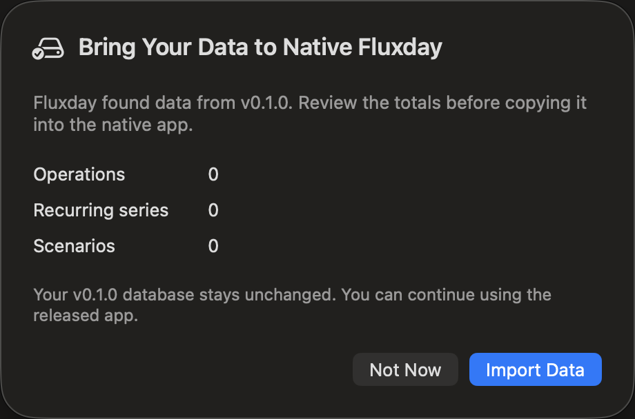

# Native data storage and migration

Fluxday v0.2.0 keeps data local and uses the system SQLite library through an actor-isolated Swift persistence package. There are no accounts, network synchronization, telemetry or third-party database dependencies.

## Storage locations

Both generations use the application-support directory for bundle identifier `app.fluxday.desktop`, but they use different filenames:

- v0.1.0 Tauri source: `fluxday.sqlite3`
- v0.2.0 native destination: `fluxday-native.sqlite3`

The native application never writes to or deletes the v0.1.0 file. Keeping separate databases makes the migration recoverable and allows the released application to remain usable until parity is verified.

## Native schema

SQLite `PRAGMA user_version` controls ordered schema migrations. Version 1 contains a single atomic `plan_snapshot` row plus a `migration_history` table. The snapshot is validated portable JSON, which keeps persistence small and preserves the exact product data model while still gaining SQLite transactions, durability and future schema migrations.

Writes use `BEGIN IMMEDIATE` and an upsert inside one transaction. Database access is serialized by `PlanStore`, a Swift actor. UI code calls it asynchronously and never owns a SQLite connection.

## v0.1.0 migration

The legacy reader:

1. detects `fluxday.sqlite3` in the existing application-support directory;
2. opens it with `SQLITE_OPEN_READONLY`;
3. checks the database and snapshot schema versions;
4. reads `app_state.payload` without modifying the source;
5. decodes and validates all settings, operations, recurrence fields, certainty, scenarios and scenario overrides;
6. returns counts and the validated plan for a confirmation preview;
7. stores the confirmed plan atomically in the native database.

Import refuses to overwrite a non-empty native destination unless the caller explicitly requests replacement. Corrupt, unsupported or invalid data fails before any destination write.

## Portable JSON

Native export retains version 4 and the v0.1.0 plan keys. Money remains integer minor units and dates remain `YYYY-MM-DD`. Import ignores known export metadata, validates the complete plan and then uses the same atomic repository path as migration.

Automated tests create real temporary SQLite databases and verify restart persistence, idempotent schema setup, replacement behavior, JSON round trips, read-only legacy detection, complete migration and failure without source modification.
