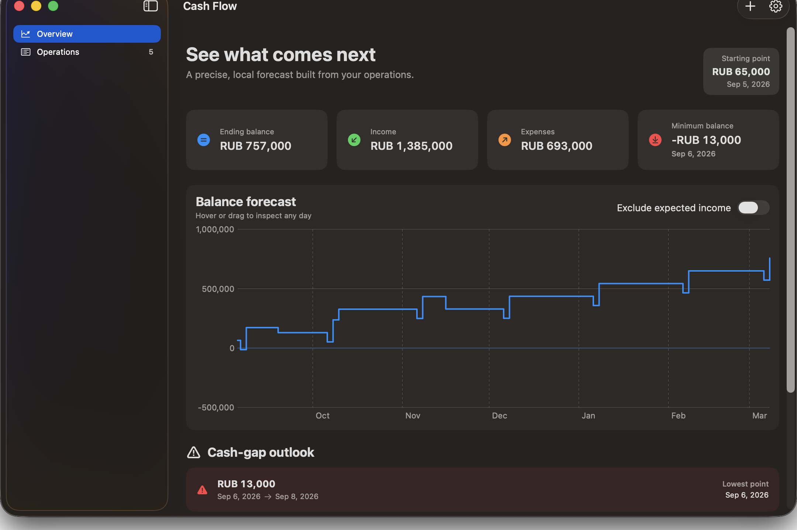
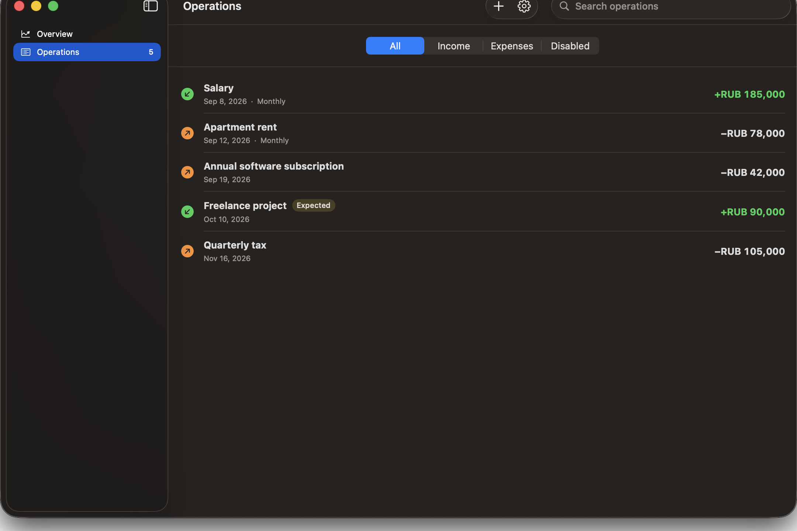
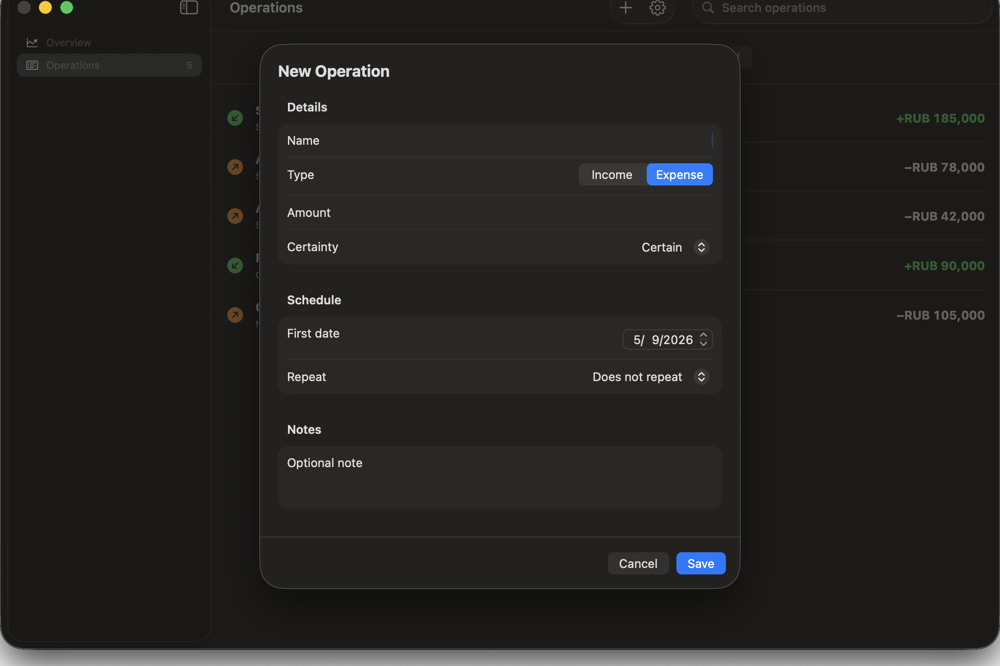
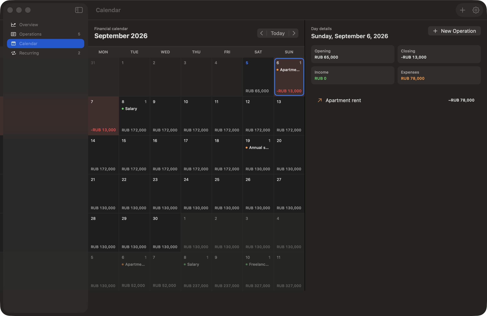
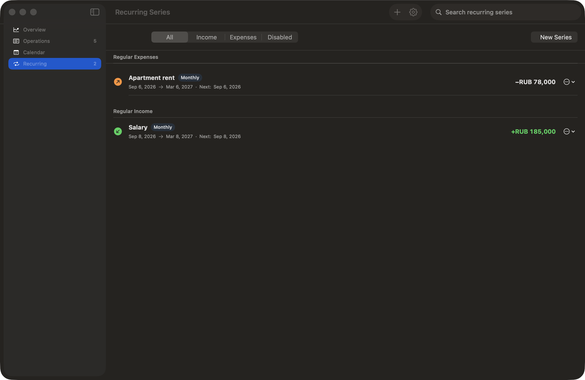
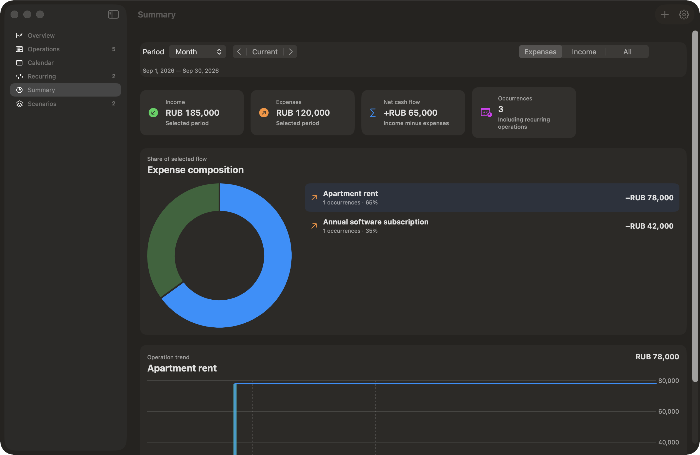
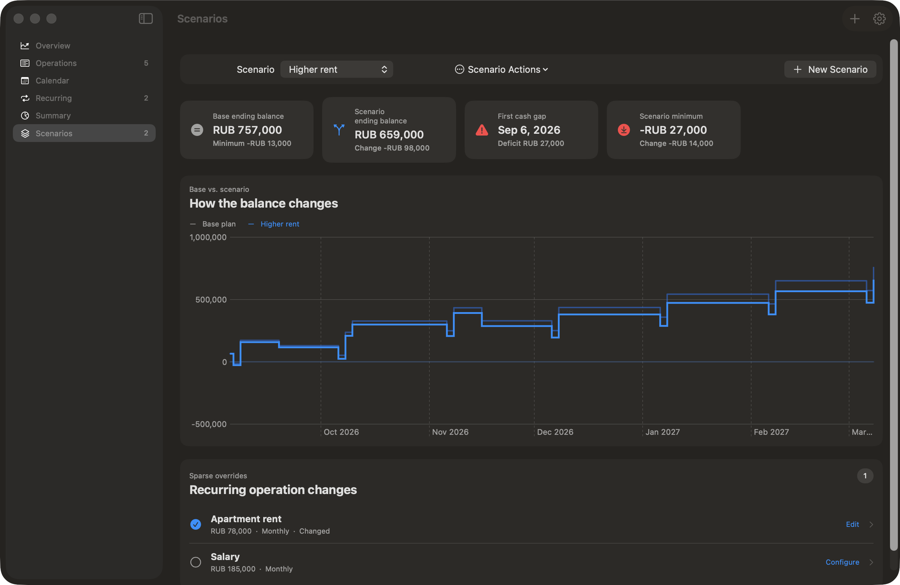
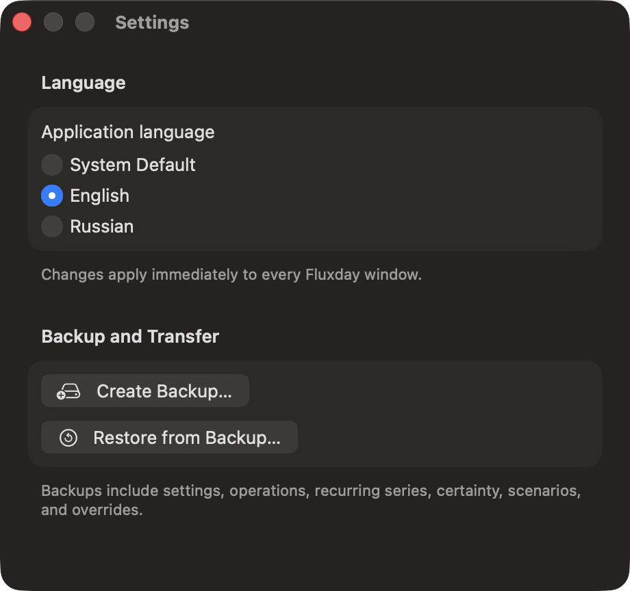

# Fluxday for macOS

This directory contains the fully native Fluxday application that will replace the Tauri implementation in v0.2.0 after feature and data parity is verified.

## Requirements

- macOS 14 or later
- Xcode 16 or later

## Build

```sh
xcodebuild \
  -project native/Fluxday.xcodeproj \
  -scheme Fluxday \
  -configuration Debug \
  -derivedDataPath native/.build/DerivedData \
  CODE_SIGNING_ALLOWED=NO \
  build
```

The v0.1.0 Tauri application remains buildable from the repository root during the migration.

Run the reusable financial core tests independently:

```sh
swift test --package-path native/CashFlowCore
swift test --package-path native/FluxdayPersistence
```

## Visual QA

The Debug build accepts `--demo` to display deterministic in-memory sample data without opening or writing either production database. This is only used for screenshots and interaction checks.
















